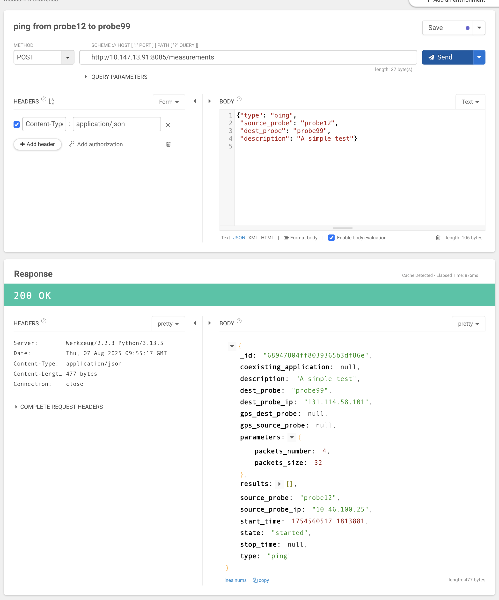
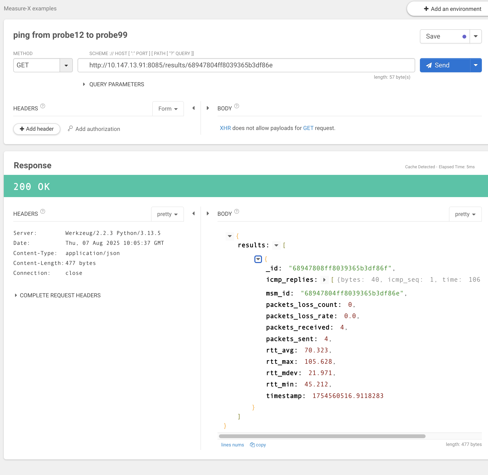
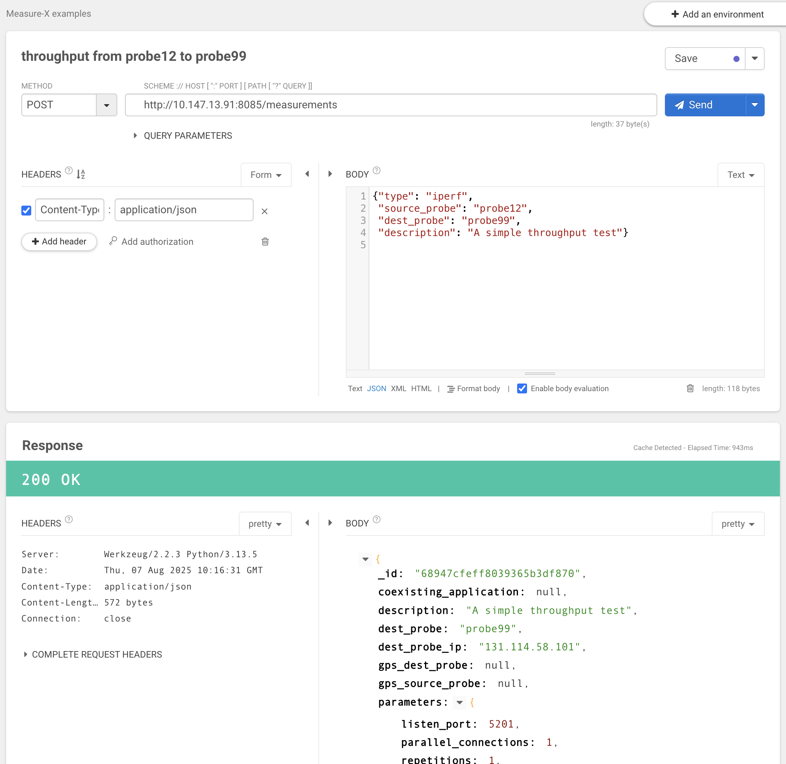
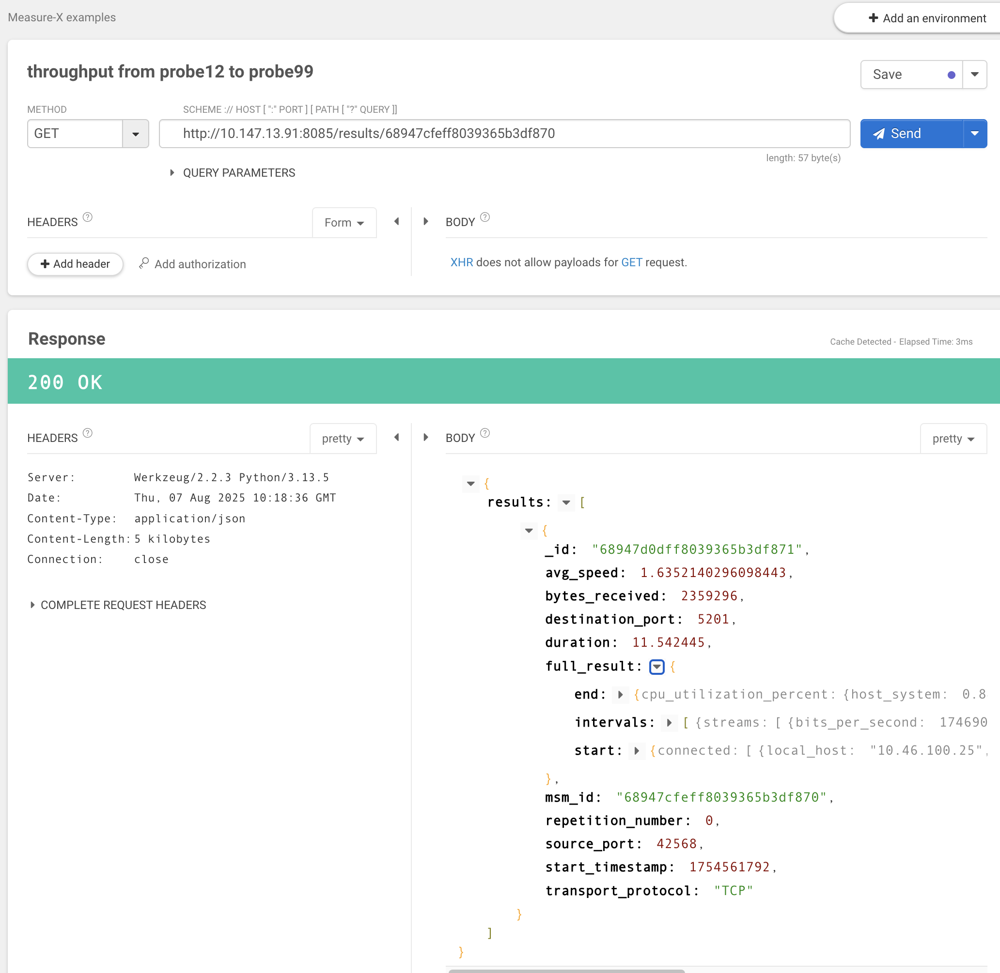

# Measure-X: Examples of Measurements

You can check that everything is working fine, by running some test meaurements on the Wi-Fi network. Actually, Masure-X can also be used to test such network, albeit with reduced functionality (for instance, energy measurments are not possible since the energy measurment chip is provided by the 5G HAT).

After having activated the pyhton virtual environment, start the controller:
````
python3 measure-x/coordinator.py
````
The controller will print some information like:
     * Running on http://10.147.13.91:8085

Start the probes in `dbg` mode. For instance, connect to probe1 via ssh and start it (or you can use the ansible playbook to start all the probes):
```
source measurex_venv/bin/activate
python3 measureX/probesFirmware/firmware.py -dbg
````
Let's suppose that probe1 and probe2 have been started. 
The following examples are based on the [Talend API tester extension](https://chromewebstore.google.com/detail/talend-api-tester-free-ed/aejoelaoggembcahagimdiliamlcdmfm) for Chrome.

To start a new ping measurement, you have to send a JSON document that describes the measurement itself. You have to use POST to the 
`http://10.147.13.91:8085/measurements` endpoint. the IP address is the on of the coordinator. Please note that it is http and not https.

This is a simple JSON that asks for a ping measurement from probe12 to probe99:
```
{"type": "ping",
 "source_probe": "probe12",
 "dest_probe": "probe99",
 "description": "A simple test"}
 ````

If everything is fine, you'll receive a 200 OK response. In the response the id assigned to the measurement will be shown. The id is needed to have information about the status of the measurment and to retrieve the results. This is an example of response: 
>{
> "_id": "68947804ff8039365b3df86e",
> "coexisting_application": null,
> "description": "A simple test",
> "dest_probe": "probe99",
> "dest_probe_ip": "131.114.58.101",
> "gps_dest_probe": null,
> "gps_source_probe": null,
> "parameters":{
> "packets_number": 4,
> "packets_size": 32
> },
> "results":[],
> "source_probe": "probe12",
> "source_probe_ip": "10.46.100.25",
> "start_time": 1754560517.1813881,
> "state": "started",
> "stop_time": null,
> "type": "ping"
>}

This is a screenshot of the browser: 


Using the measurement id, it is possible to retrieve the results. In particular, you have to send a GET request to the 
`http://10.147.13.91:8085/results/68947804ff8039365b3df86e`endpoint (the last part is the measurement id), as shown in the following example:



This is another example where throughput is measured using iperf: 
```
{"type": "iperf",
 "source_probe": "probe12",
 "dest_probe": "probe99",
 "description": "A simple throughput test"}
```



and this is the result:



The `full_result` field contains the detailed iperf3 output. 

This is another example, where energy is measured in the presence of some CBR traffic. This example does not work on Wi-Fi, but only with real 5G connectivity:
````
{
    "type": "energy",
    "source_probe": "probe12",
    "dest_probe": "probe99",
    "description": "A consumption test with coex application",
    "coexisting_application": {
        "description": "Some CBR traffic",
        "source_probe": "probe12",
        "dest_probe": "probe99",
        "packets_size": 1,
        "packets_rate": 1,
        "duration": "60",
        "delay_start": "0"
    }
}
````

After having started the energy measurement, it can be stopped by using a DELETE request using the measurement identifier provided back by the system.


