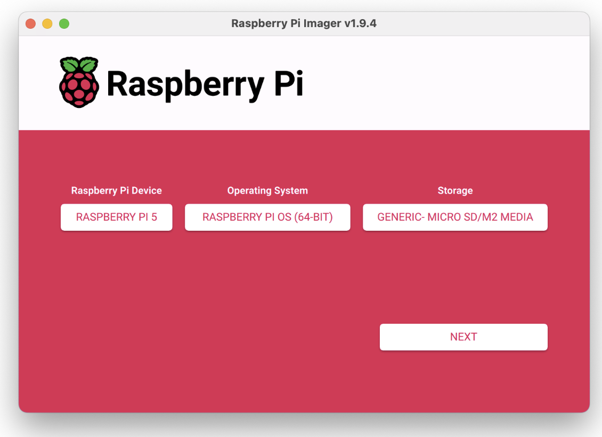
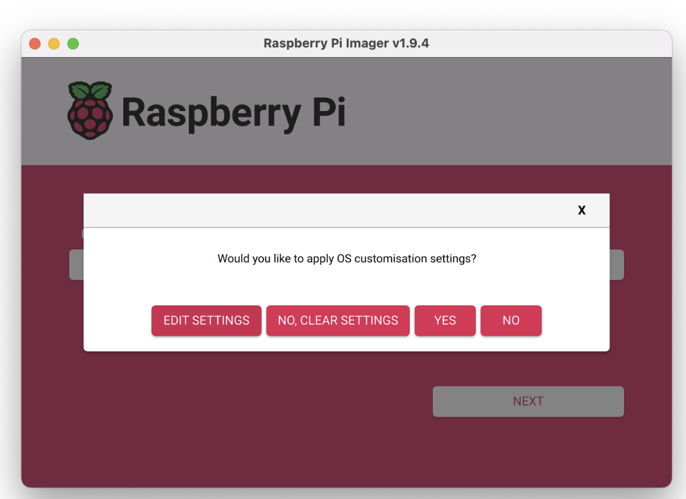
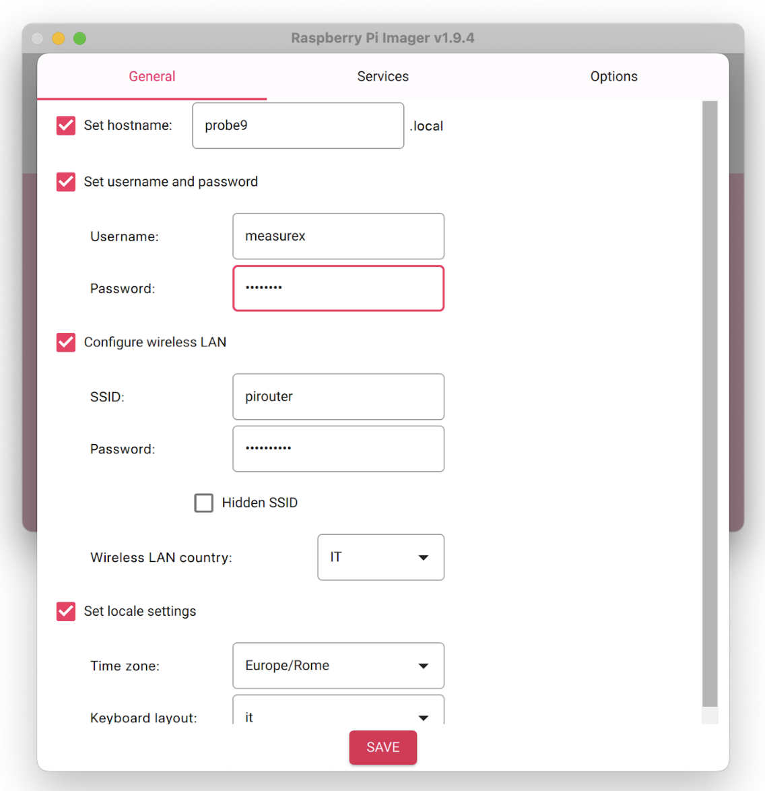
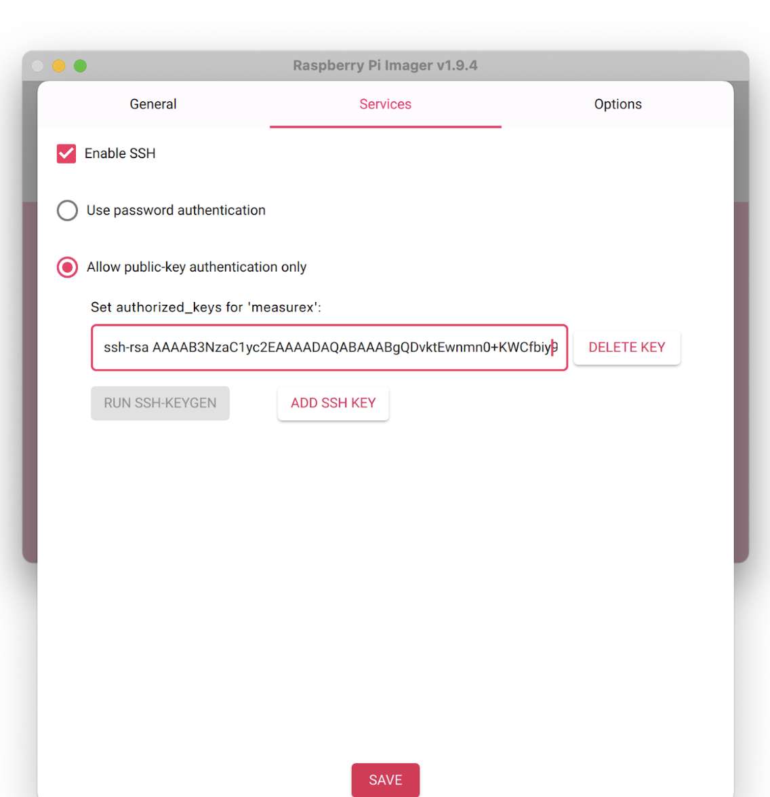
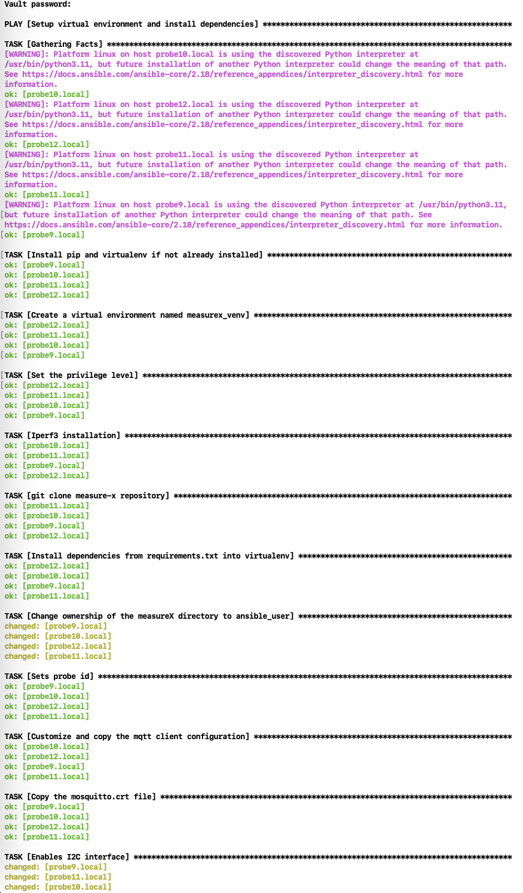

# Measure-X

A Measure-X installation requires: 
 - an MQTT broker
 - a coordinator
 - a number of probes

## Installing the broker
The MQTT broker is used to make the coordinator and the probes communicate with each other. The MQTT broker must be installed on a machine that can be reached by both probes and the coordinator. 

Measure-X is known to work with [Mosquitto](https://github.com/eclipse-mosquitto/mosquitto).

On Ubuntu, you can install mosquitto with
```
sudo apt install mosquitto mosquitto-clients
```

Create a measurex user using
```
sudo mosquitto_passwd /etc/mosquitto/passwd measurex
```
Create a certificate following the instructions available [here](http://mosquitto.org/man/mosquitto-tls-7.html)

We suppose the certificate file is `mosquitto.crt`

We also run mosquitto on port 8080 to avoid some problems with firewalls. 

The mosquitto.conf file should look like the following one:
```
#pid_file /run/mosquitto/mosquitto.pid

listener 8080

cafile /etc/mosquitto/certs/mosquitto.crt
certfile /etc/mosquitto/certs/mosquitto.crt
keyfile /etc/mosquitto/certs/mosquitto.key

persistence true
persistence_location /var/lib/mosquitto/

log_dest file /var/log/mosquitto/mosquitto.log

include_dir /etc/mosquitto/conf.d

allow_anonymous false
password_file /etc/mosquitto/passwd
```


## Installing the coordinator 
The coordinator can be installed on your own PC/Mac or onto a dedicated Raspberry PI. Let's suppose the coordinator is installed on your own PC/Mac. 

First, download the Measure-X code from the repository:
```
gh repo clone InternetMeasurements/measure-x
```
Create a virtual Python environment and activate it:
```
python3 -m venv venv
source venv/bin/activate
```
Install all the required packages:
```
python3 -m pip install -r measure-x/requirements.txt
````

The results of network measurements are stored on MongoDB. We suppose MongoDB is installed on your PC/Mac. 

Install MongoDB locally. For MacOS, you can use the following commands:
```
brew tap mongodb/brew
brew update
brew install mongodb-community@8.0
````

You can then start and stop MongoDB using the following commands:
```
brew services start mongodb-community@8.0
brew services stop mongodb-community@8.0
```

Create a measurex user:
```
mongosh admin --eval "db.createUser({
    user: 'measurex',
    pwd: chose a password,
    roles: [{ role: 'readWrite', db: 'measurexDB' }]
})"
```
Edit the `measure-x/coordinatorConfig.yaml` file to set the MongoDB password. The file should look like this:
```
mongo:
  ip_server:  127.0.0.1
  port_server: 27017
  user: measurex
  password: the password you chose for the MongoDB measurex user
  db_name: measurex
  measurements_collection_name: measurements
  results_collection_name: results
```
Please note that the MongoDB password is stored in cleartext. 

The coordinator can be started using the following command:
```
python3 measure-x/coordinator.py
```

The coordinator can also be executed on a Raspberry PI. In that case, you can use the ansible file to automate the installation operations. 


## Installing the probes

### Probes' hardware
All probes are [Raspberry PI 5](https://www.raspberrypi.com/products/raspberry-pi-5/). Each RPI5 is equipped with a HAT hosting the 5G module. 
Right now the supported HAT+5G module combination is:
 - [PCIe to 5G/4G/3G HAT designed for Raspberry Pi 5 + RM520N-GL module](https://www.waveshare.com/product/iot-communication/long-range-wireless/4g-gsm-gprs/rm520n-gl-5g-hat-plus.htm?sku=27336)
 
### Installing Raspberry Pi OS
Use the Raspberry PI Imager. 
Select
- Raspberry Pi Device: Raspberry PI 5
- Operating system: Raspberry PI OS (64 bit)
- Storage: the new SD card you want to use


Apply the following OS customisation settings before flashing the OS:


Select “Edit settings”.

Set the hostname depending on the probe you are installing (probe1, probe2, probe3, etc). 
Username: measurex, password: measurex. 

Add info for wifi access (SSID and password).


Enable ssh with public key authentication only. Run SSH-KEYGEN and press ADD SSH KEY:


Now write the customized OS image onto the card (“Would you like to apply OS customization settings?” -> YES). 

Put the card in the Raspberry PI 5 and power it on. After boot, you should be able to ping it from your PC (they are supposed to be both connected to the same wifi network, the “pirouter” in the example).
```
ping probe9.local
````

You should also be able to log onto the new probe:
```
ssh probe9.local
````

No password is needed as it uses the SSH key.  The key must NOT be regenerated for the other probes, reuse the same key.

### Installing Measure-X on probes

On probes the software is installed using ansible. 
Add the new probe to the ansible inventory file. We assume that the file name is `measurex_ansible_inventory`.

The inventory file will contains the list of all the probes: 
```
[probes]
probe9.local ansible_user=measurex
probe10.local ansible_user=measurex
probe11.local ansible_user=measurex
probe12.local ansible_user=measurex
```

To store the credentials needed for accessing the MQTT broker, we will use ansible-vault.

First, create an encripted file to store the variables using ansible-vault: 
```
ansible-vault create measure-x/yaml_ansible/vars.yml
ansible-vault edit measure-x/yaml_ansible/vars.yaml
```
edit the content of the encrypted vars.yaml file as follows:
```
---
MQTT_MEASUREX_PASSWORD: the password you chose for the measurex user in mosquitto
```

The `mosquitto.crt`file must be placed in the yaml_ansible folder. 
Run the following ansible playbook:

`ansible-playbook -i measurex_ansible_inventory measure-x/yaml_ansible/probes_initialization.yaml --ask-vault-pass` 

Provide the password of the ansible vault. 
The playbook will install the needed software on all the probes listed in the inventory file. To be more precise, the ansible playbook will configure all the probes listed in the [probes] group. In particular, it will take care of
- download Measure-X software from GitHub
- create measurex_venv, a virtual Python environment to avoid interfering with any existing Python installation.
- installing dependences defined in the file MeasureX/probesFirmware/requirements.txt
- installing the iperf3 tool for throughput measurements
- installing the waveshare Linux kernel needed to use the HAT+5G module

Each probe will also be configured with the MQTT credentials. Please note that on probes credentials are stored in cleartext. 



If the same playbook is executed again, some steps could be skipped if probes are already partially configured.


To check that everything is fine you can start a probes's Measure-X software with 
```
ssh probe9.local
source measurex_venv/bin/activate
python3 probesFirmware/firmware.py --debug
````

The --debug option of the firmware.py script can be used to test a probe using Wi-Fi instead of 5G.

A similar procedure can be used to pull onto all the probes a new version of the Measure-X software if available on the github. There is a specific Ansible playbook that can be executed as follows:
```
ansible-playbook -i measurex_ansible_inventory measure-x/yaml_ansible/git_pull.yaml
```